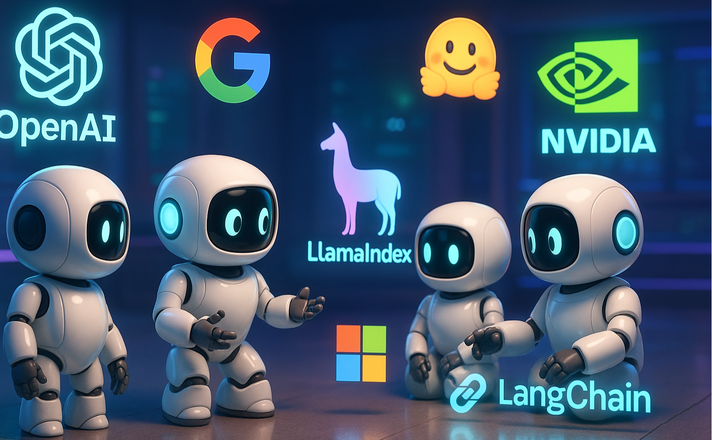

<a id="readme-top"></a>

<!-- PROJECT SHIELDS -->

<!-- PROJECT LOGO -->
<br />
<div align="center">

  <a href=".">
    
  </a>

  <h1 align="center">🤖 AgentForge</h1>

  <p align="center">
    A hands-on, production-focused comparison of modern AI agent and multi-agent frameworks. Explore real-world implementations and evaluate trade-offs across leading tools.
    <br />
    <a href="./issues/new?labels=bug&template=bug-report.md">Report Bug</a>
    ·
    <a href="./issues/new?labels=enhancement&template=feature-request.md">Request Feature</a>
  </p>
</div>

AgentForge delivers a structured, hands-on comparison of modern AI agent and multi-agent frameworks. Each framework is explored through implementation-driven examples, highlighting architecture patterns, capabilities, and real-world use cases.

## 🤖 Frameworks Included

<table>
  <thead>
    <tr>
      <th>Framework</th>
      <th>Docs</th>
      <th>Repository</th>
    </tr>
  </thead>
  <tbody>
    <tr>
      <td style="vertical-align: middle;">
        <picture>
          <source media="(prefers-color-scheme: dark)" srcset="res/ag2-dark.svg">
          <source media="(prefers-color-scheme: light)" srcset="res/ag2.svg">
          
        </picture>
      </td>
      <td>
          <a href="https://docs.ag2.ai/latest/">
            
          </a>
      </td>
      <td>
          <a href="https://github.com/ag2ai/ag2">
            
          </a>
      </td>
    </tr>
    <tr>
      <td style="vertical-align: middle;">
        <picture>
          <source media="(prefers-color-scheme: dark)" srcset="res/agno-dark.svg">
          <source media="(prefers-color-scheme: light)" srcset="res/agno.svg">
          
        </picture>
      </td>
      <td>
          <a href="https://docs.agno.com/introduction">
            
          </a>
      </td>
      <td>
          <a href="https://github.com/agno-agi/agno">
            
          </a>
      </td>
    </tr>
    <tr>
      <td style="vertical-align: middle;">
        
        <strong style="font-size: 1.2em;">Autogen</strong>
      </td>
      <td>
          <a href="https://microsoft.github.io/autogen/stable/index.html">
            
          </a>
      </td>
      <td>
          <a href="https://github.com/microsoft/autogen">
            
          </a>
      </td>
    </tr>
    <tr>
      <td>
        
      </td>
      <td>
          <a href="https://docs.crewai.com/">
            
          </a>
      </td>
      <td>
          <a href="https://github.com/crewAIInc/crewAI">
            
          </a>
      </td>
    </tr>
    <tr>
      <td style="vertical-align: middle;">
        
        <strong style="font-size: 1.2em;">Google ADK</strong>
      </td>
      <td>
          <a href="https://google.github.io/adk-docs/">
            
          </a>
      </td>
      <td>
          <a href="https://github.com/google/adk-python">
            
          </a>
      </td>
    </tr>
    <tr>
      <td style="vertical-align: middle;">
        
        
      </td>
      <td>
          <a href="https://langchain-ai.github.io/langgraph/">
            
          </a>
      </td>
      <td>
          <a href="https://github.com/langchain-ai/langgraph">
            
          </a>
      </td>
    </tr>
    <tr>
      <td style="vertical-align: middle;">
        
        
      </td>
      <td>
          <a href="https://docs.llamaindex.ai/en/stable/">
            
          </a>
      </td>
      <td>
          <a href="https://github.com/run-llama/llama_index">
            
          </a>
      </td>
    </tr>
    <tr>
      <td style="vertical-align: middle;">
        
        <strong style="font-size: 1.2em;">OpenAI Agents SDK</strong>
      </td>
      <td>
          <a href="https://openai.github.io/openai-agents-python/">
            
          </a>
      </td>
      <td>
          <a href="https://github.com/openai/openai-agents-python">
            
          </a>
      </td>
    </tr>
    <tr>
      <td style="vertical-align: middle;">
        
      </td>
      <td>
          <a href="https://ai.pydantic.dev/">
            
          </a>
      </td>
      <td>
          <a href="https://github.com/pydantic/pydantic-ai">
            
          </a>
      </td>
    </tr>
    <tr>
      <td style="vertical-align: middle;">
        
        <strong style="font-size: 1.2em;">smolagents</strong>
      </td>
      <td>
          <a href="https://huggingface.co/docs/smolagents/en/index">
            
          </a>
      </td>
      <td>
          <a href="https://github.com/huggingface/smolagents">
            
          </a>
      </td>
    </tr>
  </tbody>
</table>

## 📁 Structure

The repository is organized by framework. Each directory includes examples, configuration, and framework-specific documentation.

Examples range from simple agent tasks to advanced multi-agent workflows, RAG (Retrieval-Augmented Generation), and API integrations.

**Main modules:**
- `ag2/`
- `agno/`
- `autogen/`
- `crewai/`
- `google-adk/`
- `langgraph/`
- `llama-index/`
- `openai-agents-sdk/`
- `pydantic-ai/`
- `smolagents/`
- `study-agents-differences/`

Some modules use PDM (`pyproject.toml`), while others rely on `requirements.txt`. Always review the local `README.md` before setup.

## 🚀 Getting Started

1. **Select a framework**  
   Navigate to the corresponding directory.

2. **Install dependencies**  
   Follow the setup instructions in the module’s `README.md`.

3. **Run examples**  
   Execute scripts from basic agents to advanced multi-agent workflows.

---

## 🧪 Comparison and Experiments

The `study-agents-differences/` module centralizes benchmarking and cross-framework experimentation.

**Key capabilities:**
- Standardized agent interfaces across multiple frameworks  
- Performance benchmarking (latency, token usage, tool efficiency)  
- Comparative analysis of RAG pipelines, APIs, and multi-agent systems  
- Interactive Streamlit UI for real-time evaluation  

Run the UI:
```bash
streamlit run agent-ui.py
