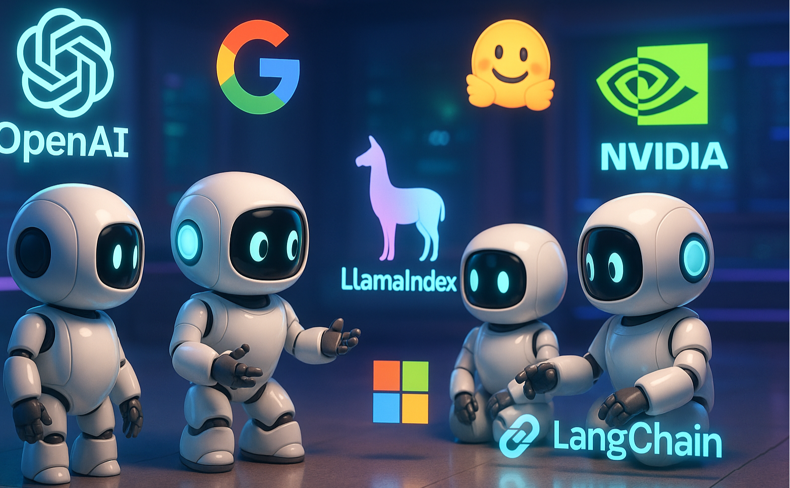
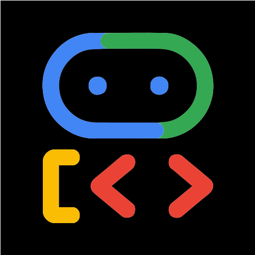

<a id="readme-top"></a>

<div align="center">

  <a href=".">
    
  </a>

  <h1 align="center">🤖 AgentForge</h1>

  <p align="center">
    The same agent, built ten different ways.
    <br />
    A hands-on comparison of modern AI agent frameworks — with runnable examples,
    a shared result contract, and a reproducible benchmark harness.
    <br />
    <br />
    <a href="#-quick-start">Quick Start</a>
    ·
    <a href="#-capability-matrix">Capability Matrix</a>
    ·
    <a href="#-find-an-example">Find an Example</a>
    ·
    <a href="#-benchmarks">Benchmarks</a>
    ·
    <a href="CONTRIBUTING.md">Contributing</a>
  </p>
</div>

---

## What is AgentForge?

Choosing an agent framework usually means reading ten sets of marketing docs and
guessing. AgentForge exists so you can read **code instead of claims**: the same
capabilities, implemented across ten frameworks, plus a harness that measures
them under identical conditions.

**Who it's for**

- Engineers evaluating which framework to adopt.
- Developers who know one framework and need to translate a pattern into another.
- Anyone learning agent concepts — tools, memory, RAG, multi-agent, MCP — who
  wants a minimal working example rather than a tutorial series.

**What you get**

| | |
| --- | --- |
| 🧩 **~90 runnable examples** | Across 10 frameworks, each focused on one concept |
| 📊 **A capability matrix** | Which framework has an example of what — [see below](#-capability-matrix) |
| ⚖️ **A fair benchmark harness** | Same model, temperature, prompts and tool code across frameworks |
| 🔌 **One result contract** | Every comparison agent returns the same `AgentResult`, success or failure |
| 🧪 **Tests that run without credentials** | `pytest` on the shared code, mocked network |

> **Honesty note.** This repository ships the benchmark *harness*, not benchmark
> *scores*. Any numbers you see were produced by a specific run, on a specific
> day, against a specific model — reproduce them yourself before trusting them.

---

## 🚀 Quick Start

```bash
git clone https://github.com/Olwtelet/AgentForge.git
cd AgentForge
```

Each framework is an **independent project** with its own pinned dependencies —
they deliberately do not share one environment (see
[Why separate environments](#why-separate-environments)). Pick one and set it up:

```bash
cd llama-index
uv sync
```

```bash
cp .env.example .env
```

Fill in the keys listed in that `.env`, then run any example:

```bash
uv run python 00_hello_world.py
```

That's it. Every framework directory follows the same three steps: `uv sync`,
`cp .env.example .env`, `uv run python <example>.py`.

<details>
<summary><b>Don't have <code>uv</code>?</b></summary>

Install it once (see [the uv docs](https://docs.astral.sh/uv/getting-started/installation/)):

```bash
pip install uv
```

Or use a plain virtual environment instead — every module has a `pyproject.toml`,
so `pip` works too:

```bash
python -m venv .venv && source .venv/bin/activate   # Windows: .venv\Scripts\activate
pip install -e .
```

</details>

---

## 🧭 Repository Architecture

```text
AgentForge/
├── ag2/  agno/  autogen/  crewai/  google-adk/       # framework examples,
├── langgraph/  llama-index/  openai-agents-sdk/      # one self-contained
├── pydantic-ai/  smolagents/                         # project each
│
├── study-agents-differences/        # the cross-framework comparison module
│   ├── agent_contract.py            #   AgentResult / TokenUsage — the shared contract
│   ├── *_agent.py                   #   the same agent, once per framework
│   ├── shared_functions/            #   identical tool code given to every framework
│   ├── prompts.py                   #   identical system prompt for every framework
│   ├── benchmarks/                  #   scenarios, datasets, runner, report
│   ├── knowledge_base/              #   documents used by the RAG scenario
│   ├── tests/                       #   pytest suite (unit tests need no credentials)
│   └── agent-ui.py                  #   Streamlit UI to chat with any agent
│
├── .github/workflows/ci.yml         # lint · compile · unit tests · secret scan
├── ruff.toml                        # repository-wide lint rules
└── res/                             # logos and images
```

### Why separate environments

Frameworks pin conflicting versions of `openai`, `pydantic`, `langchain-core`
and friends. Forcing them into one environment would mean unpinning them, which
destroys reproducibility — the opposite of the point. So each directory owns its
`pyproject.toml` and `uv.lock`, and you install only what you're studying.

---

## 🤖 Frameworks Included

| Framework | Examples | Docs | Repo |
| --- | --- | --- | --- |
|  **AG2** | [`ag2/`](ag2/) | [Docs](https://docs.ag2.ai/latest/) | [GitHub](https://github.com/ag2ai/ag2) |
|  **Agno** | [`agno/`](agno/) | [Docs](https://docs.agno.com/introduction) | [GitHub](https://github.com/agno-agi/agno) |
|  **AutoGen** | [`autogen/`](autogen/) | [Docs](https://microsoft.github.io/autogen/stable/index.html) | [GitHub](https://github.com/microsoft/autogen) |
|  **CrewAI** | [`crewai/`](crewai/) | [Docs](https://docs.crewai.com/) | [GitHub](https://github.com/crewAIInc/crewAI) |
|  **Google ADK** | [`google-adk/`](google-adk/) | [Docs](https://google.github.io/adk-docs/) | [GitHub](https://github.com/google/adk-python) |
|  **LangGraph** | [`langgraph/`](langgraph/) | [Docs](https://langchain-ai.github.io/langgraph/) | [GitHub](https://github.com/langchain-ai/langgraph) |
|  **LlamaIndex** | [`llama-index/`](llama-index/) | [Docs](https://docs.llamaindex.ai/en/stable/) | [GitHub](https://github.com/run-llama/llama_index) |
|  **OpenAI Agents SDK** | [`openai-agents-sdk/`](openai-agents-sdk/) | [Docs](https://openai.github.io/openai-agents-python/) | [GitHub](https://github.com/openai/openai-agents-python) |
|  **Pydantic AI** | [`pydantic-ai/`](pydantic-ai/) | [Docs](https://ai.pydantic.dev/) | [GitHub](https://github.com/pydantic/pydantic-ai) |
|  **smolagents** | [`smolagents/`](smolagents/smolagents-simple-examples/) | [Docs](https://huggingface.co/docs/smolagents/en/index) | [GitHub](https://github.com/huggingface/smolagents) |

---

## 📊 Capability Matrix

**This table describes what *this repository* demonstrates, not what each
framework is capable of.** A ❌ means "no example here yet" — almost always the
framework itself supports the feature. Contributions welcome: see
[CONTRIBUTING.md](CONTRIBUTING.md).

| Framework | Hello World | Tools | Structured Output | Streaming | Memory | HITL | Multi-Agent | RAG | MCP | Tracing | Evals |
| --- | :-: | :-: | :-: | :-: | :-: | :-: | :-: | :-: | :-: | :-: | :-: |
| **AG2** | ✅ | ✅ | ✅ | ❌ | ❌ | ✅ | ✅ | ❌ | ❌ | ❌ | ❌ |
| **Agno** | ✅ | ✅ | ⚠️ | ✅ | ✅ | ✅ | ⚠️ | ✅ | ❌ | ❌ | ❌ |
| **AutoGen** | ✅ | ✅ | ✅ | ✅ | ✅ | ✅ | ✅ | ✅ | ❌ | ❌ | ❌ |
| **CrewAI** | ✅ | ✅ | ✅ | ✅ | ✅ | ⚠️ | ✅ | ✅ | ❌ | ❌ | ❌ |
| **Google ADK** | ✅ | ✅ | ✅ | ❌ | ✅ | ❌ | ✅ | ⚠️ | ✅ | ❌ | ✅ |
| **LangGraph** | ✅ | ✅ | ❌ | ❌ | ✅ | ✅ | ✅ | ✅ | ❌ | ❌ | ❌ |
| **LlamaIndex** | ✅ | ✅ | ✅ | ✅ | ✅ | ✅ | ✅ | ✅ | ✅ | ✅ | ❌ |
| **OpenAI Agents SDK** | ✅ | ✅ | ✅ | ✅ | ❌ | ❌ | ✅ | ❌ | ❌ | ✅ | ✅ |
| **Pydantic AI** | ✅ | ✅ | ✅ | ✅ | ✅ | ✅ | ✅ | ❌ | ❌ | ❌ | ❌ |
| **smolagents** | ✅ | ✅ | ❌ | ❌ | ❌ | ❌ | ✅ | ❌ | ❌ | ❌ | ❌ |

**Legend** — ✅ a dedicated example exists · ⚠️ shown incidentally inside another
example, not on its own · ❌ no example in this repository yet.

<details>
<summary><b>Why the ⚠️ marks</b></summary>

- **Agno / Structured Output** — Pydantic response models appear inside
  [`6_workflow_example.py`](agno/6_workflow_example.py), not as a standalone example.
- **Agno / Multi-Agent** — [`6_workflow_example.py`](agno/6_workflow_example.py)
  orchestrates steps rather than demonstrating agent-to-agent delegation.
- **CrewAI / HITL** — a human-input tool exists in
  [`crewai-simple-examples/agents.py`](crewai/crewai-simple-examples/agents.py)
  but is wired to a Chainlit UI, not a standalone script.
- **Google ADK / RAG** — [`12_grounding.py`](google-adk/12_grounding.py) grounds
  answers in Google Search results; there is no local vector-store example.

</details>

---

## 🔎 Find an Example

Jump straight to the code for the concept you care about.

| Framework | Hello World | Tools | Structured Output | Streaming | Multi-Agent |
| --- | --- | --- | --- | --- | --- |
| **AG2** | [`0_sample_agent.py`](ag2/0_sample_agent.py) | [`1_agent_with_tools.py`](ag2/1_agent_with_tools.py) | [`2_structured_outputs.py`](ag2/2_structured_outputs.py) | — | [`4_multi_agent.py`](ag2/4_multi_agent.py) |
| **Agno** | [`1_simple_agent.py`](agno/1_simple_agent.py) | [`4_parallel_tool_calling.py`](agno/4_parallel_tool_calling.py) | [`6_workflow_example.py`](agno/6_workflow_example.py) | [`3_streaming.py`](agno/3_streaming.py) | [`6_workflow_example.py`](agno/6_workflow_example.py) |
| **AutoGen** | [`0_hello_world.py`](autogen/0_hello_world.py) | [`1_tools.py`](autogen/1_tools.py) | [`3_structured_outputs.py`](autogen/3_structured_outputs.py) | [`2_streaming_and_metrics.py`](autogen/2_streaming_and_metrics.py) | [`5_multi_agent_teams.py`](autogen/5_multi_agent_teams.py) |
| **CrewAI** | [`0_hello_world.py`](crewai/0_hello_world.py) | [`1_tools.py`](crewai/1_tools.py) | [`4_structured_outputs.py`](crewai/4_structured_outputs.py) | [`3_streaming.py`](crewai/3_streaming.py) | [`10_multi_agent_collaboration.py`](crewai/10_multi_agent_collaboration.py) |
| **Google ADK** | [`00_hello_world.py`](google-adk/00_hello_world.py) | [`01_tools.py`](google-adk/01_tools.py) | [`08_structured_outputs.py`](google-adk/08_structured_outputs.py) | — | [`04_multi_agent_systems.py`](google-adk/04_multi_agent_systems.py) |
| **LangGraph** | [`langgraph_agent.py`](study-agents-differences/langgraph_agent.py) | [`langgraph_agent.py`](study-agents-differences/langgraph_agent.py) | — | — | [`customer-support.ipynb`](langgraph/langgraph-examples/customer-support.ipynb) |
| **LlamaIndex** | [`00_hello_world.py`](llama-index/00_hello_world.py) | [`01_tools.py`](llama-index/01_tools.py) | [`02_structured_outputs.py`](llama-index/02_structured_outputs.py) | [`04_streaming.py`](llama-index/04_streaming.py) | [`09_agent_delegation.py`](llama-index/09_agent_delegation.py) |
| **OpenAI Agents SDK** | [`0_hello_world.py`](openai-agents-sdk/0_hello_world.py) | [`1_tools_and_metrics.py`](openai-agents-sdk/1_tools_and_metrics.py) | [`2_structured_outputs.py`](openai-agents-sdk/2_structured_outputs.py) | [`4_handoffs_and_streaming.py`](openai-agents-sdk/4_handoffs_and_streaming.py) | [`5_agents_as_tools.py`](openai-agents-sdk/5_agents_as_tools.py) |
| **Pydantic AI** | [`00_hello_world.py`](pydantic-ai/00_hello_world.py) | [`01_tools_and_metrics.py`](pydantic-ai/01_tools_and_metrics.py) | [`04_structured_outputs.py`](pydantic-ai/04_structured_outputs.py) | [`03_streaming.py`](pydantic-ai/03_streaming.py) | [`07_agent_delegation.py`](pydantic-ai/07_agent_delegation.py) |
| **smolagents** | [`simple-agent.py`](smolagents/smolagents-simple-examples/simple-agent.py) | [`simple-agent.py`](smolagents/smolagents-simple-examples/simple-agent.py) | — | — | [`multi-agent.py`](smolagents/smolagents-simple-examples/multi-agent.py) |

| Framework | Memory | Human-in-the-Loop | RAG | MCP | Tracing / Evals |
| --- | --- | --- | --- | --- | --- |
| **AG2** | — | [`3_human_in_the_loop.py`](ag2/3_human_in_the_loop.py) | — | — | — |
| **Agno** | [`agno_agent.py`](study-agents-differences/agno_agent.py) | [`5_human_in_the_loop.py`](agno/5_human_in_the_loop.py) | [`agno_rag_api_agent.py`](study-agents-differences/agno_rag_api_agent.py) | — | — |
| **AutoGen** | [`7_memory.py`](autogen/7_memory.py) | [`4_human_in_the_loop.py`](autogen/4_human_in_the_loop.py) | [`autogen-project/`](autogen/autogen-project/) | — | — |
| **CrewAI** | [`7_memory.py`](crewai/7_memory.py) | [`crewai-simple-examples/`](crewai/crewai-simple-examples/) | [`9_knowledge.py`](crewai/9_knowledge.py) | — | — |
| **Google ADK** | [`07_memory.py`](google-adk/07_memory.py) | — | [`12_grounding.py`](google-adk/12_grounding.py) | [`11_mcp_tools.py`](google-adk/11_mcp_tools.py) | [`14_evaluation.py`](google-adk/14_evaluation.py) |
| **LangGraph** | [`langgraph_agent.py`](study-agents-differences/langgraph_agent.py) | [`customer-support.ipynb`](langgraph/langgraph-examples/customer-support.ipynb) | [`langgraph-project/`](langgraph/langgraph-project/) | — | — |
| **LlamaIndex** | [`03_memory.py`](llama-index/03_memory.py) | [`06_human_in_the_loop.py`](llama-index/agent_workflows/06_human_in_the_loop.py) | [`10_agentic_rag.py`](llama-index/10_agentic_rag.py) | [`mcp/`](llama-index/mcp/) | [`12_observability.py`](llama-index/agent_workflows/12_observability.py) |
| **OpenAI Agents SDK** | — | — | — | — | [`8_tracing.py`](openai-agents-sdk/8_tracing.py) · [`7_llm_as_a_judge.py`](openai-agents-sdk/7_llm_as_a_judge.py) |
| **Pydantic AI** | [`06_message_history.py`](pydantic-ai/06_message_history.py) | [`10_human_in_the_loop.py`](pydantic-ai/10_human_in_the_loop.py) | — | — | — |
| **smolagents** | — | — | — | — | — |

---

## ⚖️ Benchmarks

The [`study-agents-differences/`](study-agents-differences/) module implements
**the same agent in every framework** and measures them under identical
conditions.

### What is measured

- **Latency** — wall-clock time for one `chat()` call.
- **Token usage** — prompt, completion and total, as reported by each framework.
- **Tool calls** — where the framework exposes the count.
- **Failure rate** — errors are recorded as results, not swallowed.

### What is held constant

Model · temperature · system prompt · user prompts · **the actual Python code
behind each tool** · knowledge base · memory setting · iteration count ·
timeout · retries · result shape.

The shared tool implementations live in
[`shared_functions/`](study-agents-differences/shared_functions/) and are
registered into every framework, so no framework gets a smarter tool than
another.

### Running a benchmark

```bash
cd study-agents-differences
uv sync
cp .env.example .env
```

```bash
uv run python -m benchmarks.runner --list
```

```bash
uv run python -m benchmarks.runner --scenario web_search --iterations 5
```

Results are written as JSONL — one object per run:

```json
{"framework": "langgraph", "scenario": "web_search", "prompt_id": "ucl_2024_explicit",
 "iteration": 1, "model": "gpt-4o-mini", "provider": "azure", "temperature": 0.0,
 "elapsed_seconds": 2.43, "input_tokens": 100, "output_tokens": 80,
 "total_tokens": 180, "tool_calls": 2, "success": true, "error": null}
```

Turn them into Markdown tables:

```bash
uv run python -m benchmarks.report benchmarks/results/run-*.jsonl -o REPORT.md
```

The report is generated from the recorded runs — no hand-copied numbers.

### Limitations — read before drawing conclusions

Benchmark results depend on the **model**, **network conditions**, **provider
load**, **library version**, **prompt wording**, **tool implementation** and the
**specific run**. A framework being faster here does not make it faster for your
workload.

Two things are deliberately *not* equalised, because they are intrinsic to each
framework: the **retrieval pipeline** (each uses its own vector store and
chunking) and the **agent loop** (ReAct vs function-calling vs graph agents take
different numbers of model round-trips). Details in
[`benchmarks/README.md`](study-agents-differences/benchmarks/README.md).

**Current status: not executed — API credentials required.** This repository
ships the harness and datasets. Figures collected by the original author with an
earlier, less controlled setup are preserved in
[`study-agents-differences/README.md`](study-agents-differences/README.md) and
labelled as historical.

### Interactive UI

Chat with any of the comparison agents side by side:

```bash
cd study-agents-differences
uv run streamlit run agent-ui.py
```

---

## 🧪 Tests

Unit tests run with **no credentials and no network** — every HTTP call is mocked.

```bash
cd study-agents-differences
uv run pytest
```

Integration tests (which call real APIs and spend tokens) are opt-in:

```bash
uv run pytest -m integration
```

CI runs lint, byte-compiles every example, runs the unit tests and scans for
secrets on every pull request. Integration tests only run on manual dispatch.

---

## 📚 Further Reading

- [CONTRIBUTING.md](CONTRIBUTING.md) — add a framework, add an example, update benchmarks
- [SECURITY.md](SECURITY.md) — reporting vulnerabilities and handling credentials
- [`study-agents-differences/README.md`](study-agents-differences/README.md) — the comparison module in depth
- [`study-agents-differences/benchmarks/README.md`](study-agents-differences/benchmarks/README.md) — benchmark methodology

---

## ⚠️ A Note on Credentials

Every module reads its configuration from a local `.env` file that is **never
committed**. Copy `.env.example`, fill it in, and keep it local. If you believe a
credential has been exposed, see [SECURITY.md](SECURITY.md).

<p align="right">(<a href="#readme-top">back to top</a>)</p>
