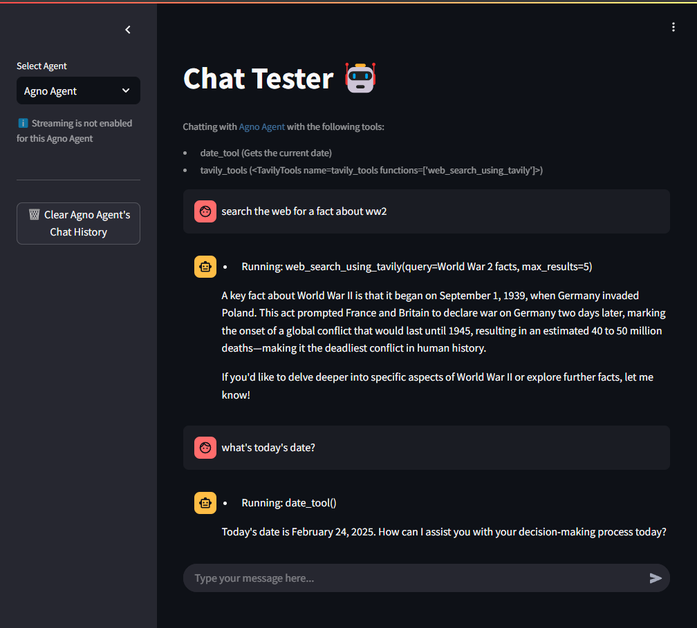
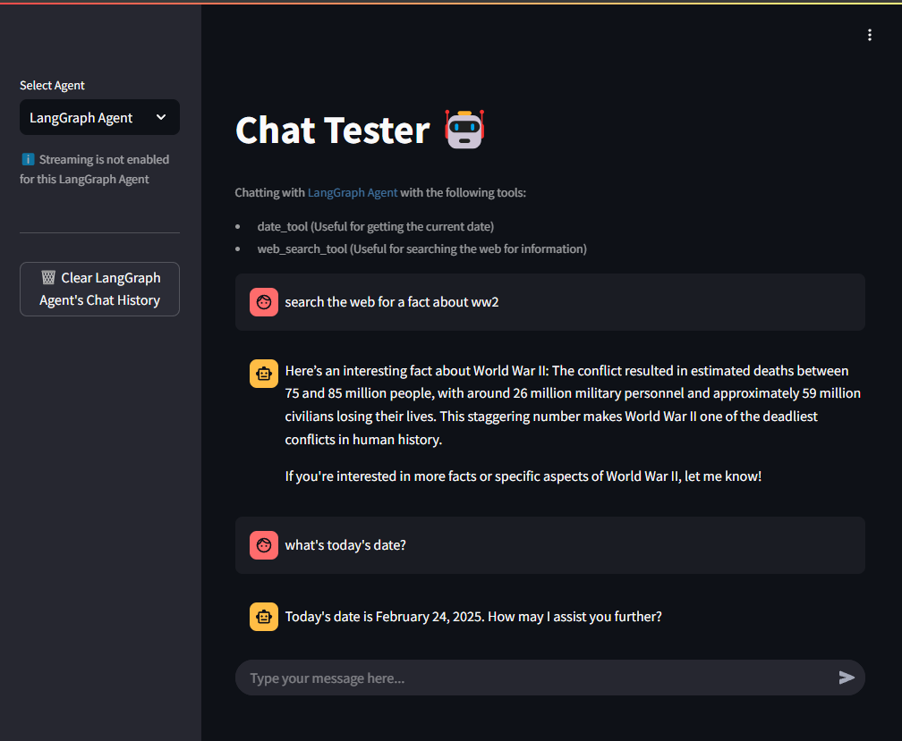

# Cross-Framework Agent Comparison

This module implements **the same agent in several frameworks** — **[Agno](https://docs.agno.com/introduction)**,
**[LangGraph](https://www.langchain.com/langgraph)**, **[LlamaIndex](https://docs.llamaindex.ai/en/stable/)**,
**[OpenAI](https://platform.openai.com/docs/guides/function-calling)** and
**[Pydantic AI](https://ai.pydantic.dev/)** — so they can be compared under
identical conditions: same model, same temperature, same system prompt, same
prompts, and *the same Python code behind every tool*.

Jump to: [Setup](#setup) · [Agents](#agents) · [Benchmarks](#benchmarks) ·
[The result contract](#the-result-contract) · [UI](#ui) ·
[Historical results](#historical-results)

---

## Setup

```bash
uv sync
```

```bash
cp .env.example .env
```

Fill in the keys you need — you only need credentials for the provider you
actually run. See [`.env.example`](.env.example) for the full list.

<details>
<summary>Without <code>uv</code></summary>

```bash
python -m venv .venv && source .venv/bin/activate   # Windows: .venv\Scripts\activate
pip install -e .
```

</details>

---

## Layout

```text
study-agents-differences/
├── agent_contract.py        # AgentResult / TokenUsage — the shared contract
├── prompts.py               # identical system prompt for every framework
├── settings.py              # configuration (model, temperature, keys)
├── utils.py                 # CLI runner and metric aggregation
├── agent-ui.py              # Streamlit UI
│
├── agno_agent.py            # web-search agents ─┐
├── langgraph_agent.py                          │ same task,
├── llama_index_agent.py                        │ one file per
├── llama_index_fc_agent.py                     │ framework
├── openai_agent.py                             │
├── pydantic_ai_agent.py                       ─┘
│
├── agno_rag_api_agent.py        # RAG + API agents ─┐ same task,
├── langgraph_rag_api_agent.py                      │ one file per
├── llama_index_rag_api_agent.py                   ─┘ framework
│
├── shared_functions/        # identical tool code given to every framework
├── knowledge_base/          # documents used by the RAG scenario
├── benchmarks/              # scenarios, datasets, runner, report
└── tests/                   # pytest suite (unit tests need no credentials)
```

---

## Agents

| Module | Framework | Tools |
| --- | --- | --- |
| [`agno_agent.py`](agno_agent.py) | Agno | date, web search |
| [`langgraph_agent.py`](langgraph_agent.py) | LangGraph | date, web search |
| [`llama_index_agent.py`](llama_index_agent.py) | LlamaIndex (ReAct) | date, web search |
| [`llama_index_fc_agent.py`](llama_index_fc_agent.py) | LlamaIndex (function calling) | date, web search |
| [`openai_agent.py`](openai_agent.py) | OpenAI SDK (manual loop) | date, web search |
| [`pydantic_ai_agent.py`](pydantic_ai_agent.py) | Pydantic AI | date, web search |
| [`agno_rag_api_agent.py`](agno_rag_api_agent.py) | Agno | RAG, date, F1 API, Metro API |
| [`langgraph_rag_api_agent.py`](langgraph_rag_api_agent.py) | LangGraph | RAG, F1 API, Metro API |
| [`llama_index_rag_api_agent.py`](llama_index_rag_api_agent.py) | LlamaIndex | RAG, F1 API, Metro API |

Each module runs standalone:

```bash
uv run python langgraph_agent.py
```

### Flags

| Flag | Meaning |
| --- | --- |
| `--provider {azure,openai,other}` | LLM provider. Default `azure`. |
| `--mode {metrics,metrics-loop}` | Report execution time and token usage. Omit for an interactive terminal chat. |
| `--iter N` | Iterations. Required with `metrics-loop`. |
| `--no-memory` | Run without conversation history. |
| `--create` | Rebuild the agent on every iteration (cold start). |
| `--verbose` | Print the agent's logs and responses. |
| `--file PATH` | Append responses to a file instead of stdout. |

Example:

```bash
uv run python llama_index_rag_api_agent.py --mode metrics-loop --iter 30 --create --no-memory
```

> For structured, comparable results prefer the [benchmark harness](#benchmarks)
> over `--mode metrics-loop`; the flags above produce console output, not data
> you can aggregate.

---

## The result contract

Every agent's `chat()` returns an [`AgentResult`](agent_contract.py) — **on
success and on failure alike**. Callers never have to guess whether they got a
string, a tuple, or an exception:

```python
result = agent.chat("who won the Champions League in 2024?")

if result.error:
    print(f"failed: {result.error}")
else:
    print(result.content)
    print(f"{result.elapsed_seconds:.2f}s, {result.usage.total_tokens} tokens")
```

```python
@dataclass
class AgentResult:
    content: str
    elapsed_seconds: float
    usage: TokenUsage | None = None
    error: str | None = None
    tool_calls: int | None = None   # None means "not reported by this framework"
```

This is what lets the UI, the CLI runner and the benchmark runner stay
framework-agnostic. A contract test in
[`tests/unit/test_repo_hygiene.py`](tests/unit/test_repo_hygiene.py) fails the
build if any agent breaks it.

---

## Benchmarks

Full methodology: [`benchmarks/README.md`](benchmarks/README.md).

```bash
uv run python -m benchmarks.runner --list
```

```bash
uv run python -m benchmarks.runner --scenario web_search --iterations 5
```

```bash
uv run python -m benchmarks.report benchmarks/results/run-*.jsonl -o REPORT.md
```

Three scenarios ship with the repository:

| Scenario | Measures | Frameworks |
| --- | --- | --- |
| `web_search` | Single-turn question requiring the shared web-search tool | Agno, LangGraph, LlamaIndex (×2), OpenAI, Pydantic AI |
| `rag` | Retrieval over the local Champions League knowledge base | Agno, LangGraph, LlamaIndex |
| `api_tools` | Multi-tool prompt hitting the shared F1 and Metro helpers | Agno, LangGraph, LlamaIndex |

Results are JSONL, one object per run, including failures. The Markdown report
is generated from those records — never hand-written.

**Status: not executed — API credentials required.**

---

## Tests

```bash
uv run pytest
```

Unit tests run with no credentials and no network — every HTTP call is mocked.
Integration tests are opt-in:

```bash
uv run pytest -m integration
```

---

## UI

```bash
uv run streamlit run agent-ui.py
```

Pick a framework from the sidebar and chat with it. Errors are surfaced as
errors rather than being rendered as if they were the agent's answer, and each
response shows its latency and token count.




---

## Historical results

> ⚠️ **These numbers are historical.** They were collected by the original
> author before the benchmark harness existed, with an earlier setup in which
> temperature was not pinned, prompts were not versioned in a dataset, and
> library versions were not recorded. They are kept because the qualitative
> observations remain useful — **do not cite the figures as current**. Reproduce
> them with [`benchmarks/`](benchmarks/) instead.

Raw response logs from those runs are preserved in
[`benchmarks/results/legacy-runs/`](benchmarks/results/legacy-runs/).

### Response time, with memory

**Prompt:** _search the web for who won the Champions League final in 2024?_

| Metric | Agno | LangGraph | LlamaIndex |
| --- | --- | --- | --- |
| Response time — 20× | 5.41 ± 1.19s | 6.04 ± 2.61s | 5.36 ± 2.02s |
| Response time — 30× | 5.84 ± 1.01s | 6.17 ± 1.14s | 5.32 ± 2.26s |
| Response time — 50× | 4.24 ± 0.78s | 8.48 ± 2.56s | 3.00 ± 3.24s |
| Response time — 100× | 4.39 ± 0.73s | 9.45 ± 4.73s | 2.64 ± 2.29s |

**Observations**

- **Agno** — consistent, organised answers; markdown-formatted where relevant; no errors.
- **LangGraph** — well-structured responses, but memory is a bottleneck: storing the
  conversation degrades performance as history grows, sharply so by iteration 100.
- **LlamaIndex** — direct answers with no unnecessary verbosity; no errors in 100 iterations.

### Response time, without memory

**(agent deleted and recreated each iteration)**

**Prompt:** _search the web for who won the Champions League final in 2024?_

| Metric | Agno | LangGraph | LlamaIndex | OpenAI |
| --- | --- | --- | --- | --- |
| Response time — 50× | 4.58 ± 1.03s | 4.22 ± 1.11s | 4.12 ± 1.01s | 3.83 ± 0.99s |
| Response time — 100× | 4.28 ± 0.76s | 3.31 ± 0.59s | 3.63 ± 0.66s | 3.61 ± 0.83s |

**Prompt:** _who won the Champions League final in 2024?_

| Metric | Agno | LangGraph | LlamaIndex | OpenAI |
| --- | --- | --- | --- | --- |
| Response time — 100× | 4.16 ± 0.65s | 3.35 ± 0.56s | 3.60 ± 0.61s | 3.34 ± 0.51s |

**Observations** — tools were called 100% of the time, and omitting "search the
web for" did not affect response time. LlamaIndex was the most concise;
LangGraph the most verbose.

### Tokens

| Metric | Agno | LangGraph | LlamaIndex | OpenAI |
| --- | --- | --- | --- | --- |
| Prompt tokens | 1999.2 | 1946.1 | 2121.7 | 1888.5 |
| Completion tokens | 65.3 | 53.5 | 76.9 | 58.3 |
| Total tokens | 2064.5 | 1999.7 | 2198.6 | 1946.7 |

**Observations**

- Token counts depend heavily on the system prompt and agent context.
- **Agno** and **LangGraph** report per-step metrics (time, tokens, time-to-first-token).
- **LlamaIndex** needs a token counter attached to the LLM constructor
  ([reference](https://docs.llamaindex.ai/en/stable/examples/observability/TokenCountingHandler/)).

### RAG

**Prompt:** _Ball possession in Benfica's game?_ (from `matches-1.md`)

| Metric | Agno | LangGraph | LlamaIndex |
| --- | --- | --- | --- |
| Response time — 100× | 3.30 ± 0.75s | 2.68 ± 1.35s | 2.86 ± 1.05s |
| Tokens — 100× | 4439.3 | 4877.2 | 3279.9 |
| Retrieval misses — 100× | 2 / 100 | 4 / 100 | 2 / 100 |

**Prompt:** _Benfica's UCL match score?_

| Metric | Agno | LangGraph | LlamaIndex |
| --- | --- | --- | --- |
| Response time — 100× | 3.17 ± 0.74s | 2.43 ± 1.09s | 2.74 ± 0.79s |
| Tokens — 100× | 4515.9 | 5053.3 | 3341.0 |
| Retrieval misses — 100× | 0 / 100 | 0 / 100 | 0 / 100 |

**Observations** — LangGraph initially failed retrieval roughly 50% of the time
and needed explicit pre-splitting before indexing:

```python
text_splitter = RecursiveCharacterTextSplitter.from_tiktoken_encoder(
    model_name=settings.embeddings_model_name,
    chunk_size=800, chunk_overlap=80,
)
doc_splits = text_splitter.split_documents(documents)
```

### API tools

**Prompt:** _Tell me the waiting time at the CG station and the status of the red
line, and also give me information about Formula 1 driver number 44!_

| Metric | Agno | LangGraph | LlamaIndex |
| --- | --- | --- | --- |
| Response time — 100× | 5.49 ± 1.40s | 4.24 ± 1.35s | 6.41 ± 2.47s |
| Tokens — 100× | 1849.2 | 1412.2 | 3913.4 |
| Misses — 100× | 0 / 100 | 0 / 100 | 0 / 100 |

**Observations** — the LlamaIndex prompt was not tuned for this task, so its
token count (and therefore its latency) is higher than it needs to be.

> 💡 Across every measurement here, agent performance was strongly influenced by
> the system prompt. Treat prompt wording as a variable, not a constant.
